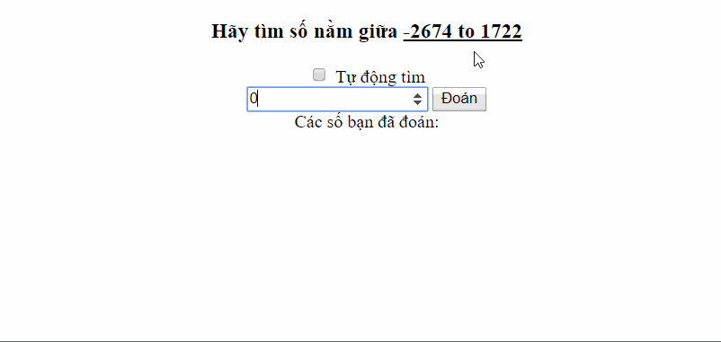

# Number Guessing Game

This is an web demo of Number Gussing Game.
Live Demo [Here](https://hoangtran0410.github.io/CoderSchool_Courses/Week%201/Number%20Guessing%20Game/Number_Guessing_Game.html).

**Time spent:** 5 hours spent in total

Completed user stories:

 * [x] Required: Setting up UI elements
 * [x] Required: Bind the event to elements
 * [x] Required: Get Value From User Input
 * [x] Required: Show the correct message
 * [x] Optional: Show user's past guesses
 * [ ] Optional: Change message container color
 * [x] Optional: Limit person to 12 guesses, show many guesses remaining
 * 
 * [x] My Optional: Simulate position of numbers
 * [x] My Optional: Auto Guessing

**Walkthrough of game:**

GIF created with [LiceCap](http://www.cockos.com/licecap/).
