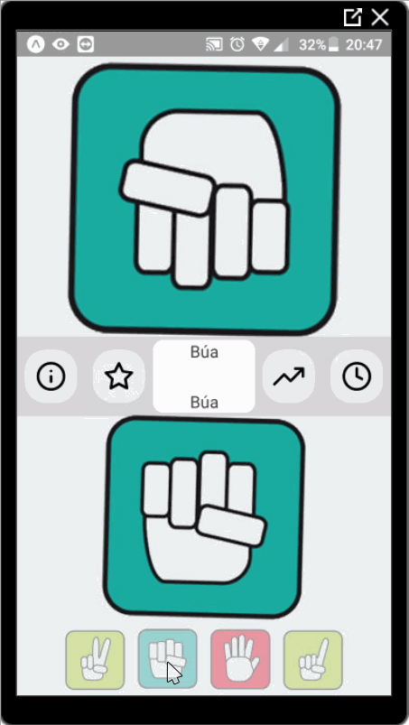

# # Rock, Paper, Scissors - Expo React Native

  

This is an simple react native app about **Rock, Paper, Scissors** (**Kéo Búa Bao**) game.

  

**Time spent:** 18 hours spent in total

  

Completed user stories:

  Required:

*  [x] User can select Rock, Paper, or Scissors

*  [x] User can see image of their selection

*  [x] User can see text of their selection

*  [x] User can see image of computer's selection

*  [x] User can see text of computer's selection

*  [x] User can see prompt indicating who won the round

Optional

*  [x] User can see how many games they've played total

*  [x] User can see how games they've won, lose, tied.

*  [x] User can see the percentages of wins, losses, and tie games they've had

  

**Walk through of app:**

  

  

GIF created with [LiceCap](http://www.cockos.com/licecap/).

  
  

**How to install:**

  

1. Create a [blank Expo Project](https://hoangtran0410.github.io/CoderSchool_Courses/TutorialPrepare)

2. Download all folders and files in this **Profile App** repository

3. Copy and paste to blank Project you have created